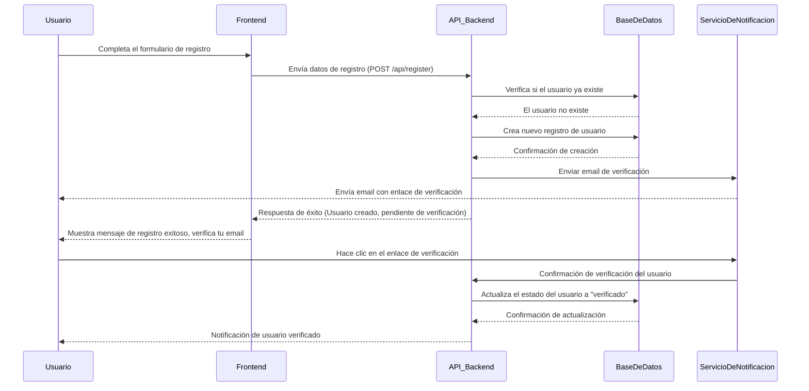
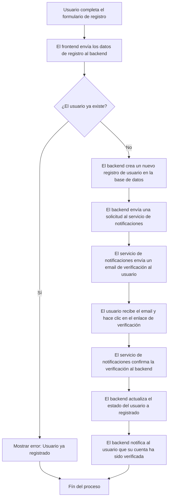

# Proyecto: Plataforma de Gestión de Eventos y Reservas

## Descripción General:

Desarrolla una aplicación backend que permita a organizadores crear eventos y a usuarios registrarse y reservar entradas para dichos eventos. La plataforma soportará funcionalidades como autenticación, gestión de usuarios, eventos, reservas, pagos y notificaciones.

## Características Principales:

### 1. Autenticación y Autorización:
- Implementa autenticación segura utilizando JWT (JSON Web Tokens).
- Roles de usuario: Administrador, Organizador, Usuario.

### 2. Gestión de Usuarios:
- Registro y login de usuarios.
- Perfil de usuario con información personal y preferencias.
- Cambio de contraseña y recuperación de cuenta.

### 3. Gestión de Eventos:
- Organizadores pueden crear, actualizar y eliminar eventos.
- Información del evento: título, descripción, fecha, hora, ubicación, capacidad, precio.
- Categorías y etiquetas para facilitar la búsqueda.

### 4. Sistema de Reservas:
- Usuarios pueden buscar y reservar entradas para eventos.
- Gestión de disponibilidad según la capacidad del evento.
- Generación de códigos QR para entradas.

### 5. Procesamiento de Pagos:
- Integración con pasarelas de pago como Stripe o PayPal.
- Gestión de transacciones y emisión de comprobantes.

### 6. Notificaciones:
- Envío de notificaciones por correo electrónico y SMS para confirmaciones y recordatorios.
- Integración con servicios como Twilio para SMS y SendGrid para emails.

### 7. Comentarios y Valoraciones:
- Los usuarios pueden dejar comentarios y valoraciones sobre eventos a los que asistieron.
- Moderación de comentarios por parte de los organizadores o administradores.

### 8. API RESTful:
- Diseño e implementación de endpoints RESTful para todas las operaciones.
- Documentación de la API utilizando Swagger/OpenAPI.

### 9. Seguridad y Validación:
- Validación de datos de entrada con Hibernate Validator.
- Manejo de excepciones y respuestas de error coherentes.
- Protección contra ataques comunes (inyecciones SQL, XSS, CSRF).

### 10. Testing:
- Pruebas unitarias y de integración con JUnit y Mockito.
- Pruebas de API utilizando Spring MockMvc.

### 11. Despliegue y Entrega Continua:
- Contenerización de la aplicación con Docker.
- Configuración de un pipeline CI/CD con Jenkins o GitHub Actions.
- Despliegue en servicios cloud como AWS Elastic Beanstalk, Heroku o Google App Engine.

### 12. Monitorización y Logs:
- Implementación de logs con Logback.
- Monitorización de la aplicación con Spring Boot Actuator.
- Integración con herramientas como ELK Stack (Elasticsearch, Logstash, Kibana).

## Tecnologías y Herramientas a Utilizar:

**Framework Principal:** Spring Boot

### Módulos de Spring:
- **Spring Web:** Para crear APIs RESTful.
- **Spring Security:** Para autenticación y autorización.
- **Spring Data JPA:** Para interacción con la base de datos.
- **Spring Boot Actuator:** Para monitorización.

### Base de Datos:
- Relacional: PostgreSQL o MySQL.
- Migraciones: Flyway o Liquibase.

### Otros:
- Mapeo Objeto-Relacional (ORM): Hibernate.
- Validación: Hibernate Validator.
- Documentación de API: Swagger/OpenAPI.
- Testing: JUnit, Mockito, Spring Test.

## Pasos para Desarrollar el Proyecto:

### 1. Configuración Inicial:
- Utiliza Spring Initializr para crear el proyecto con las dependencias necesarias.
- Configura el archivo `application.properties` o `application.yml` con los detalles de la base de datos y otros ajustes.

### 2. Modelado de la Base de Datos:
- Define las entidades: Usuario, Evento, Reserva, Pago, Comentario.
- Establece las relaciones entre entidades (OneToMany, ManyToMany, etc.).

### 3. Implementación de Repositorios:
- Crea interfaces que extiendan de `JpaRepository` para cada entidad.
- Implementa consultas personalizadas si es necesario.

### 4. Servicio de Autenticación:
- Configura Spring Security para manejar la seguridad de la aplicación.
- Implementa JWT para autenticación stateless.
- Define filtros de seguridad y manejo de sesiones.

### 5. Controladores REST:
- Crea controladores para manejar las solicitudes HTTP.
- Define endpoints para cada funcionalidad (ejemplo: `/api/events`, `/api/users`, `/api/reservations`).

### 6. Lógica de Negocio:
- Implementa servicios que contengan la lógica de negocio.
- Aplica el principio de separación de responsabilidades.

### 7. Procesamiento de Pagos:
- Regístrate y configura una cuenta de prueba con Stripe o PayPal.
- Implementa la lógica para crear cargos y manejar respuestas de la pasarela de pago.

### 8. Notificaciones:
- Configura servicios de correo electrónico y SMS.
- Implementa plantillas para correos electrónicos y mensajes de texto.

### 9. Documentación y Validación:
- Anota tus controladores y modelos para generar documentación con Swagger.
- Utiliza anotaciones de validación en tus entidades (ejemplo: `@NotNull`, `@Size`).

### 10. Testing:
- Escribe pruebas unitarias para los servicios y repositorios.
- Escribe pruebas de integración para los controladores.

### 11. Despliegue:
- Escribe un `Dockerfile` para la aplicación.
- Configura un pipeline de CI/CD para automatizar el proceso de construcción y despliegue.
- Despliega la aplicación en el servicio cloud elegido.

### 12. Monitorización y Logs:
- Configura Spring Boot Actuator para exponer métricas y puntos de control de salud.
- Integra una solución de logging centralizado.

## Mejoras Opcionales:

### Soporte Multilenguaje:
- Implementa internacionalización (i18n) para soportar múltiples idiomas.

### Búsqueda Avanzada:
- Implementa funcionalidades de búsqueda y filtrado utilizando Elasticsearch.

### Cacheo:
- Utiliza Redis para cachear respuestas frecuentes y mejorar el rendimiento.

### Microservicios:
- Divide la aplicación en microservicios si el proyecto escala en complejidad.

## Recursos y Referencias Útiles:

### Documentación Oficial de Spring:
- [Spring Boot](https://spring.io/projects/spring-boot)
- [Spring Security](https://spring.io/projects/spring-security)
- [Spring Data JPA](https://spring.io/projects/spring-data-jpa)

### Guías y Tutoriales:
- [Building a RESTful Web Service](https://spring.io/guides/gs/rest-service/)
- [Securing a Web Application](https://spring.io/guides/gs/securing-web/)
- [Accessing Data with JPA](https://spring.io/guides/gs/accessing-data-jpa/)

### Integración con Pasarelas de Pago:
- [Stripe API Reference](https://stripe.com/docs/api)
- [PayPal Developer Documentation](https://developer.paypal.com/)

### Herramientas de Testing:
- [JUnit 5 User Guide](https://junit.org/junit5/docs/current/user-guide/)
- [Mockito Documentation](https://site.mockito.org/)

### Contenerización y Despliegue:
- [Docker Documentation](https://docs.docker.com/)
- [Guía de Despliegue en AWS Elastic Beanstalk](https://aws.amazon.com/elasticbeanstalk/?trk=c5d0e627-e186-4b0a-b0ea-084708c1ac84&sc_channel=ps&s_kwcid=AL!4422!10!71331052503625!71331576802630&ef_id=ad056780b6d6118c3d59008bbbd7ba55:G:s&msclkid=ad056780b6d6118c3d59008bbbd7ba55)

### Diagrama de secuencia para el registro de usuario

### Diagrama de flujo
